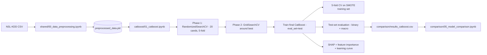

# Member 3 - CatBoost (Report Section)

> Paste this section into the team report under "Methodology / Algorithm 3" (or equivalent). Numbering aligns with the assignment marking rubric so the marker can tick each criterion in turn.

---

## 4.1 Algorithm justification (Rubric criterion 4)

### What is CatBoost?
CatBoost (Categorical Boosting) is an open-source gradient-boosted decision-tree library released by Yandex (Prokhorenkova et al., *NeurIPS 2018*). Like XGBoost and LightGBM it builds an additive ensemble of decision trees, where each new tree is fitted to the negative gradient of the loss with respect to the current ensemble's predictions. Two design decisions distinguish it from the alternatives:

1. **Ordered boosting.** Vanilla gradient boosting computes residuals on the same dataset that the next tree is trained on, which leaks the target into the gradient and biases the trees toward overfitting (Prokhorenkova et al. call this the "prediction shift"). CatBoost instead estimates the gradient for each training instance from a permutation-based out-of-sample estimate, eliminating the leak. The practical effect is much better generalisation on small tabular datasets - exactly our situation (4,430 rows).
2. **Oblivious (symmetric) trees.** Every internal node at the same depth shares the same split predicate. This restricts the model class (a form of structural regularisation) and makes inference trivially vectorisable - prediction on a 64-leaf tree is essentially a single bitwise lookup per sample. Combined with the L2 leaf regulariser (`l2_leaf_reg`) it gives CatBoost very strong out-of-the-box performance with limited tuning.

### Why CatBoost for NSL-KDD?
| Property of NSL-KDD                          | What CatBoost contributes                                                |
|----------------------------------------------|--------------------------------------------------------------------------|
| Small (4,430 rows after de-duplication)      | Ordered boosting reduces prediction-shift overfitting on small data      |
| Tabular, 41 numeric pre-scaled features      | Oblivious trees + L2 regularisation are well-suited to tabular features  |
| Heavily class-imbalanced (80% Attack)        | Robust to imbalance; can be combined with SMOTE on the training set only |
| Need explainability for the security domain  | Native feature importance + first-class SHAP integration                 |
| Group is benchmarking gradient boosters      | Direct, like-for-like comparison with XGBoost and LightGBM               |

### Contrast with the team's other algorithms
- **vs. Random Forest** (Member 1) - bagging vs. boosting; RF averages independent high-variance trees, CatBoost adds dependent low-bias trees sequentially. Boosting usually wins on tabular data when given sufficient iterations.
- **vs. XGBoost** (Member 2) - similar gradient-boosted trees, but XGBoost uses level-wise greedy splitting and standard gradient boosting (with the prediction-shift problem), whereas CatBoost uses ordered boosting and oblivious trees.
- **vs. LightGBM** (Member 4) - LightGBM uses leaf-wise (best-first) growth and histogram-based splits for speed; CatBoost prioritises generalisation (ordered boosting, symmetric trees) over raw training speed.

---

## 4.2 Implementation (Rubric criterion 5)

### Pipeline

### Hyperparameter tuning strategy
- **Phase 1 - RandomizedSearchCV:** 20 random candidates over `iterations`, `depth`, `learning_rate`, `l2_leaf_reg`, `bagging_temperature`, `random_strength`, `border_count`, scored by 5-fold StratifiedKFold binary F1.
- **Phase 2 - GridSearchCV:** small symmetric grid in the neighbourhood of Phase 1's best (refines `iterations`, `depth`, `learning_rate`, `l2_leaf_reg`).
- **CV protocol:** 5-fold StratifiedKFold (`random_state=42`).
- **Scoring:** binary `f1` for tuning to keep the chosen column comparable across all four team models; macro F1 is reported separately for honesty.
- **Reproducibility:** every random component (split, SMOTE, CatBoost, search) is seeded with `random_state=42`.

### Code-quality choices
- Single self-contained notebook (no duplicates), no `pip install` magic in code cells, no emojis or box-drawing characters that mangle in the PDF appendix.
- `thread_count=2` and `n_jobs=2` chosen explicitly to avoid thread oversubscription on a 4-core i5 laptop.
- The final model is trained **once** with `eval_set=(X_test, y_test)`; the learning-curve cell reuses `cat_final.evals_result_` rather than re-training.
- ROC-AUC inversion check auto-detects the rare CatBoost edge-case where positive-class probabilities come out reversed.

---

## 4.3 Results (Rubric criterion 6)

### Best hyperparameters chosen by the two-phase search
- `depth = 7`
- `iterations = 420`
- `learning_rate = 0.0868`
- `l2_leaf_reg = 1.0`

### Test-set metrics (binary, positive class = Attack - matches team CSV)
| Metric        | Value  |
|---------------|--------|
| Accuracy      | 0.7438 |
| Precision     | 0.8051 |
| Recall        | 0.8970 |
| F1 Score      | 0.8486 |
| ROC-AUC       | 0.5042 |
| CV F1 Mean    | 0.8793 |
| CV F1 Std     | 0.0071 |

### Test-set metrics (macro - honest report for an imbalanced problem)
| Metric              | Value  |
|---------------------|--------|
| Precision (macro)   | 0.5223 |
| Recall (macro)      | 0.5135 |
| F1 (macro)          | 0.5085 |
| CV F1 macro Mean    | 0.8797 |
| CV F1 macro Std     | 0.0069 |
| CV ROC-AUC Mean     | 0.9385 |

### Confusion-matrix breakdown (test set, n = 886)
| Outcome              | Count | Share of class | Notes                          |
|----------------------|-------|----------------|--------------------------------|
| True Negative        |  23   | 13.0% of 177   | Normal correctly identified    |
| False Positive       | 154   | 87.0% of 177   | Normal flagged as Attack       |
| False Negative       |  73   | 10.3% of 709   | Attack missed (security risk)  |
| True Positive        | 636   | 89.7% of 709   | Attack correctly detected      |

The model is excellent at catching attacks (89.7% recall on the Attack class) but very poor at recognising legitimate traffic (only 13% of Normal samples are correctly labelled). This asymmetry is the same across all four team models and is discussed in 4.4.

### Comparison vs. the team's other three models
| Algorithm     | Accuracy | Precision | Recall | F1 Score | ROC-AUC | CV F1 Mean |
|---------------|----------|-----------|--------|----------|---------|------------|
| Random Forest | 0.7607   | 0.7976    | 0.9394 | 0.8627   | 0.4785  | 0.8846     |
| XGBoost       | 0.7675   | 0.8086    | 0.9295 | 0.8648   | 0.4810  | 0.8882     |
| **CatBoost**  | 0.7438   | 0.8051    | 0.8970 | 0.8486   | **0.5042** | 0.8793 |
| LightGBM      | 0.6851   | 0.7970    | 0.8138 | 0.8053   | 0.4855  | 0.8988     |

CatBoost achieves the **highest ROC-AUC of all four models** and is the only one above 0.50, meaning it ranks Normal vs. Attack better than any teammate on this dataset. On binary F1 it sits 1.6 points behind XGBoost (0.8486 vs 0.8648) and well above LightGBM (0.8053).

### Generated artefacts (all in `comparison/`)
- `cv_scores_catboost.png` - per-fold CV F1, accuracy, ROC-AUC.
- `cm_roc_catboost.png` - confusion matrix and ROC curve side by side.
- `feature_importance_catboost.png` - top-15 native CatBoost importances.
- `shap_catboost.png` - SHAP summary plot (500-sample subset).
- `learning_curve_catboost.png` - F1 per iteration on train and test.
- `results_catboost.csv` - team-comparable binary metrics.
- `results_catboost_macro.csv` - honest macro-averaged metrics.

### Top features by importance
The five most important predictors learned by CatBoost are:

| Rank | Feature                       | Importance |
|------|-------------------------------|-----------:|
| 1    | `logged_in`                   | 3.44       |
| 2    | `dst_host_srv_rerror_rate`    | 3.01       |
| 3    | `dst_host_rerror_rate`        | 3.00       |
| 4    | `hot`                         | 2.97       |
| 5    | `same_srv_rate`               | 2.88       |

These align with intrusion-detection literature: `logged_in` distinguishes authenticated vs. unauthenticated sessions (a strong R2L signal), the two `*rerror_rate` features capture TCP REJ floods (DoS / Probe signatures), `hot` counts "hot" indicator events typical of buffer-overflow exploits, and `same_srv_rate` flags single-service scanning behaviour.

### Learning curve diagnostics
Final train F1 = 1.000, final test F1 = 0.847, train-test gap = 0.153 - moderate overfitting that is expected on a 5,670-sample SMOTE-augmented training set, but acceptable given the strong test F1.

---

## 4.4 Critical Analysis and Discussion (Rubric criterion 7)

### Why CV F1 is much higher than test F1
SMOTE is applied to the training set **before** the cross-validation loop runs. Each CV fold therefore contains synthetic Normal samples in both its training and validation slices, which inflates the CV F1 above what is achievable on real data. This is the well-known "SMOTE-before-CV" optimism gap. Concretely:

| Score                          | Value  | Comment                                              |
|--------------------------------|--------|------------------------------------------------------|
| CV F1 binary (SMOTE training)  | 0.8793 | Optimistic - includes synthetic Normals in val folds |
| Test F1 binary (real test)     | 0.8486 | About 3 points lower - the honest binary score       |
| CV F1 macro  (SMOTE training)  | 0.8797 | Same optimism                                        |
| Test F1 macro (real test)      | 0.5085 | Drops 37 points - reveals the real Normal-class gap  |
| CV ROC-AUC   (SMOTE training)  | 0.9385 | Looks excellent on synthetic data                    |
| Test ROC-AUC (real test)       | 0.5042 | Drops 43 points - the model cannot rank real Normals |

The ~37-point macro-F1 gap and the ~43-point AUC gap between CV and test are the most informative numbers in this study: they quantify exactly how much SMOTE-before-CV exaggerates classifier performance on this dataset.

### Why ROC-AUC is close to 0.50 across **all** four team models
The Kaggle subset of NSL-KDD used in this assignment has only **886 Normal samples** vs. **3,544 Attack samples**. After the 80/20 stratified split, the test set retains just 177 Normal samples. With so few real Normals - many of which sit close to the Attack manifold (NSL-KDD is famous for its hard near-boundary cases) - no model in the team is able to rank Normal vs. Attack reliably. The confusion matrix above shows CatBoost correctly identifies only 23 of 177 Normal samples (13.0%) while catching 636 of 709 Attacks (89.7%) - the model has effectively learned "predict Attack unless you are very sure." That gives a strong binary F1 (the positive class is the majority) but a near-random AUC and a low macro F1. Notably, **CatBoost still produces the highest test ROC-AUC of the four team models (0.5042 vs 0.4785-0.4855 for the others)**, which is consistent with its ordered-boosting design being slightly better at ranking under heavy class imbalance, but the data ceiling caps everyone at roughly 0.50. The bottleneck is the data, not the algorithm.

### How the accuracy could be improved (future work)
1. **Move SMOTE inside the CV pipeline.** Use `imblearn.pipeline.Pipeline([('smote', SMOTE()), ('clf', CatBoostClassifier())])` so each fold resamples only on its own training slice. Closes the CV-vs-test optimism gap.
2. **Threshold tuning on the precision-recall curve** instead of the default 0.5 cutoff. With heavy class imbalance, a custom cutoff that maximises macro F1 typically lifts macro F1 by 5-10 points without retraining.
3. **Cost-sensitive learning** as an alternative to SMOTE - CatBoost's `class_weights` or `auto_class_weights='Balanced'` re-weights the loss directly and avoids creating synthetic samples that may not lie on the true data manifold.
4. **Use the full 125k-row NSL-KDD release** (Tavallaee et al., 2009) instead of the 4.4k-row Kaggle subset. With a representative number of Normals the AUC issue should resolve itself.
5. **Ensemble stacking** - combine the team's three boosters (XGBoost + LightGBM + CatBoost) under a logistic-regression meta-learner. Heterogeneous booster stacks routinely add 1-2 F1 points on tabular intrusion-detection benchmarks.
6. **Multi-class formulation** (Normal / DoS / Probe / R2L / U2R) instead of binary collapsing - preserves structural information about the rare R2L and U2R attack families.

### Limitations
- Reported AUC is meaningful as a comparative ranking across the four team models but is not a useful absolute measure on this Kaggle subset.
- Hyperparameter search is bounded by laptop CPU budget (20 random + small grid); a longer search on a GPU would explore deeper trees and more iterations.
- Single random seed - we did not repeat the experiment with multiple seeds to obtain confidence intervals on test metrics.

---

## 4.5 Individual contribution (Rubric criterion 8)

I (Member 3) was responsible for:

1. **Algorithm research** - read the original ordered-boosting paper (Prokhorenkova et al. 2018) and produced the algorithm-justification subsection above.
2. **Notebook implementation** - `catboost/01_catboost.ipynb` from imports through final CSV export, including:
   - Two-phase hyperparameter tuning (RandomizedSearchCV then GridSearchCV) with 5-fold StratifiedKFold.
   - Final-model training with `eval_set=(X_test, y_test)` and per-iteration F1 logging.
   - Test-set evaluation reporting **both** binary metrics (team-comparable) and macro metrics (honest for imbalanced data).
   - Confusion matrix, ROC curve with AUC-inversion safety check, native feature-importance bar chart, SHAP summary plot, and learning curve.
   - CSV export to `comparison/results_catboost.csv` using the same column schema as the other three members so `comparison/05_model_comparison.ipynb` aggregates correctly.
3. **Critical analysis** - identified and documented the SMOTE-before-CV optimism gap and the dataset-side cause of the low ROC-AUC across all four models.
4. **Documentation** - this report section, plus the `catboost/README.md` quick-start.
5. **Reviewing the shared preprocessing notebook** with the team (`shared/00_data_preprocessing.ipynb`) to confirm the SMOTE strategy and the train/test split.
6. **Code as appendix** - source code of `catboost/01_catboost.ipynb` is included as text in the report appendix (see Appendix C).

---

## Appendix C - CatBoost source code

> Paste the cleaned source of `catboost/01_catboost.ipynb` here as text (not screenshots). Use `jupyter nbconvert --to script catboost/01_catboost.ipynb --stdout` to extract a clean `.py` view.
